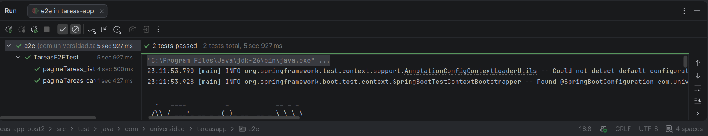
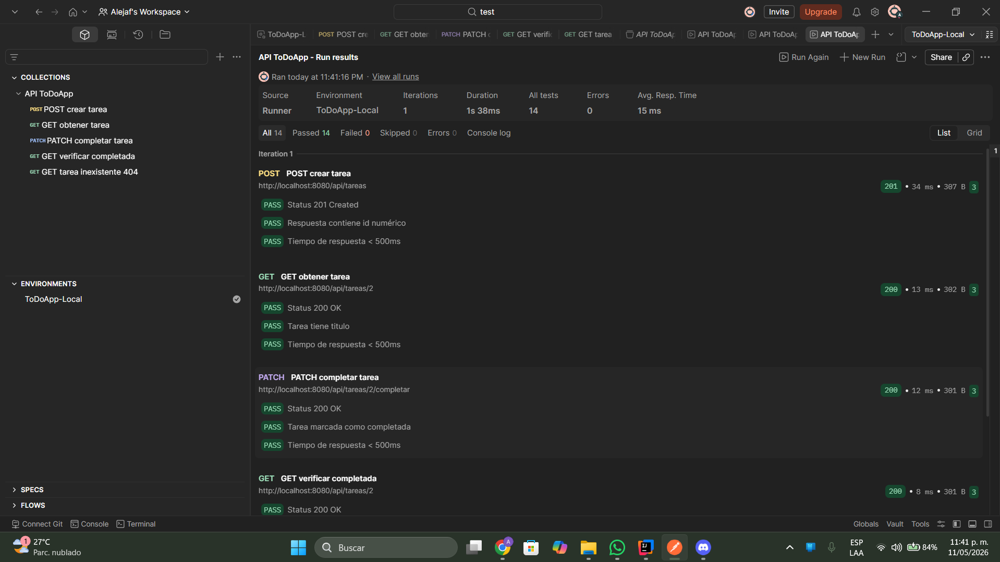
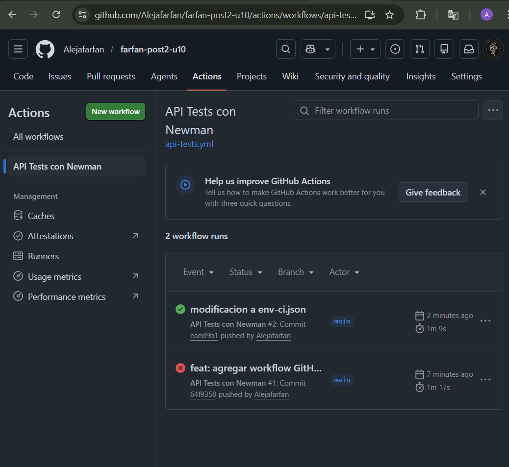

# Pruebas E2E con Selenium, Postman y Newman

Aplicación Spring Boot de gestión de tareas con pruebas de extremo a extremo implementando Selenium WebDriver con Page Object Model, colección Postman con test scripts, y automatización mediante Newman en GitHub Actions.

---

## Prerrequisitos

- Java 17 o superior
- Maven 3.9.x
- Google Chrome versión estable instalado
- Node.js 18+ con npm
- Postman Desktop v10+
- Cuenta GitHub con Actions habilitado

---

## Instalación de Newman

```bash
npm install -g newman
```

---

## Cómo ejecutar las pruebas

### Ejecutar todos los tests unitarios e integración

```bash
mvn test
```

### Ejecutar solo los tests de Selenium E2E

La aplicación se levanta automáticamente en modo headless durante los tests:

```bash
mvn test -Dtest=TareasE2ETest
```

### Ejecutar la colección Postman con Newman localmente

Primero levanta la aplicación:

```bash
mvn spring-boot:run
```

Luego en otra terminal ejecuta Newman:

```bash
newman run postman/ColeccionToDo.json --environment postman/env-local.json
```

---

## Estructura del proyecto

```
src/
├── main/java/com/universidad/tareasapp/
│   ├── TareasAppApplication.java
│   ├── entity/Tarea.java
│   ├── repository/TareaRepository.java
│   ├── service/TareaService.java
│   └── controller/
│       ├── TareaController.java
│       └── TareasViewController.java
└── test/java/com/universidad/tareasapp/
    └── e2e/
        ├── TareasPage.java
        ├── NuevaTareaPage.java
        └── TareasE2ETest.java
postman/
├── ColeccionToDo.json
├── env-local.json
└── env-ci.json
.github/
└── workflows/
    └── api-tests.yml

```

---

## Descripción de las pruebas

### Checkpoint 1 — Selenium con Page Object Model

**TareasPage** encapsula todos los selectores de la vista `/tareas` en constantes privadas `By`. Expone métodos de alto nivel para interactuar con la página sin exponer detalles de implementación a los tests.

| Selector | Tipo | Elemento |
|---|---|---|
| `BTN_NUEVA` | `By.id` | Botón Nueva Tarea |
| `LIST_ITEMS` | `By.cssSelector` | Items de la lista |

**TareasE2ETest** usa `@SpringBootTest` que levanta el servidor en el puerto real y ejecuta Chrome en modo headless mediante WebDriverManager.

| Test | Descripción |
|---|---|
| `paginaTareas_cargaCorrectamente` | Verifica que el título de la página contiene "Tareas" |
| `paginaTareas_listaTareasVisible` | Verifica que la lista de tareas es accesible |

---

### Checkpoint 2 — Colección Postman

**Colección:** `API ToDoApp`
**Entorno:** `ToDoApp-Local` con variable `baseUrl = http://localhost:8080`

| # | Request | Método | URL | Tests |
|---|---|---|---|---|
| 1 | POST crear tarea | POST | `/api/tareas` | Status 201, contiene id, tiempo < 500ms |
| 2 | GET obtener tarea | GET | `/api/tareas/{{tareaId}}` | Status 200, título correcto, tiempo < 500ms |
| 3 | PATCH completar tarea | PATCH | `/api/tareas/{{tareaId}}/completar` | Status 200, completada = true, tiempo < 500ms |
| 4 | GET verificar completada | GET | `/api/tareas/{{tareaId}}` | Status 200, completada sigue en true, tiempo < 500ms |
| 5 | GET tarea inexistente | GET | `/api/tareas/9999` | Status 404, tiempo < 500ms |

**Resultado:** 14 tests — 0 failures

El request POST guarda el `id` generado en la variable de colección `tareaId`, que los requests siguientes usan automáticamente.

---

### Checkpoint 3 — Newman en GitHub Actions

**Workflow:** `.github/workflows/api-tests.yml`

El pipeline se ejecuta automáticamente en cada `push` y `pull_request`. Los pasos son:

1. Checkout del repositorio
2. Configurar Java 17 (Temurin)
3. Compilar el JAR con `mvn package -DskipTests`
4. Iniciar la aplicación en segundo plano
5. Esperar que la app responda en `http://localhost:8080/api/tareas`
6. Instalar Newman globalmente
7. Ejecutar la colección con el entorno CI

**Resultado:** Workflow con check verde en la pestaña Actions del repositorio.

---

## Configuración de base de datos

Las pruebas y el pipeline CI usan **H2 en memoria**. No se requiere base de datos externa.

---

## Evidencias

### Checkpoint 1 — Tests de Selenium en verde


### Checkpoint 2 — Postman Runner con 0 failures


### Checkpoint 3 — GitHub Actions con check verde


---

## Resultados generales

```
Selenium E2E:   Tests run: 2, Failures: 0, Errors: 0
Postman:        All tests: 14, Failed: 0, Errors: 0
GitHub Actions: Workflow passing 
```