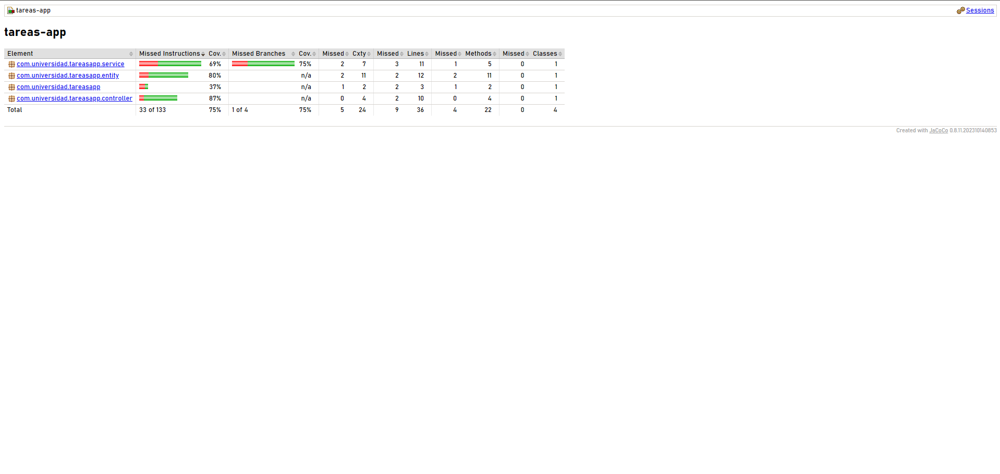

# Post-Contenido 1 Unidad 10
```Alejandra Farfan Duarte - 02230131026 - Ingenieria De Sistema ```

Aplicación Spring Boot de gestión de tareas con suite de pruebas automatizadas.

## Tecnologías
- Java 17, Spring Boot 3.2, Maven
- JUnit 5, Mockito, AssertJ
- JaCoCo para cobertura de código
- H2 en memoria para pruebas

## Cómo ejecutar las pruebas
```bash
mvn test
```

## Cómo ver el reporte de cobertura
```bash
mvn test
# Luego abrir: target/site/jacoco/index.html
```
## Captura de pantalla del reporte de cobertura


## Clases de prueba

| Clase | Tipo | Descripción |
|---|---|---|
| `TareaServiceTest` | Unitaria (@ExtendWith Mockito) | Prueba crear, buscar y validaciones del servicio |
| `TareaControllerTest` | Integración (@WebMvcTest) | Prueba endpoints HTTP con MockMvc |
| `TareaRepositoryTest` | Integración (@DataJpaTest) | Prueba consultas JPA con H2 en memoria |